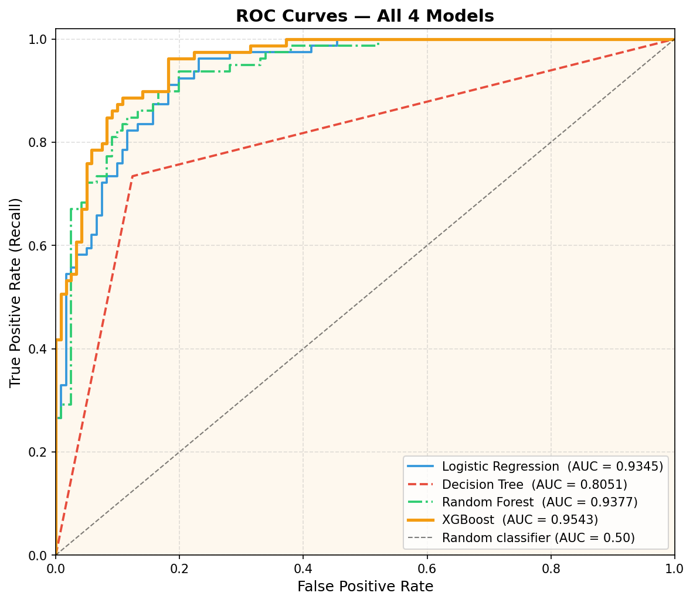
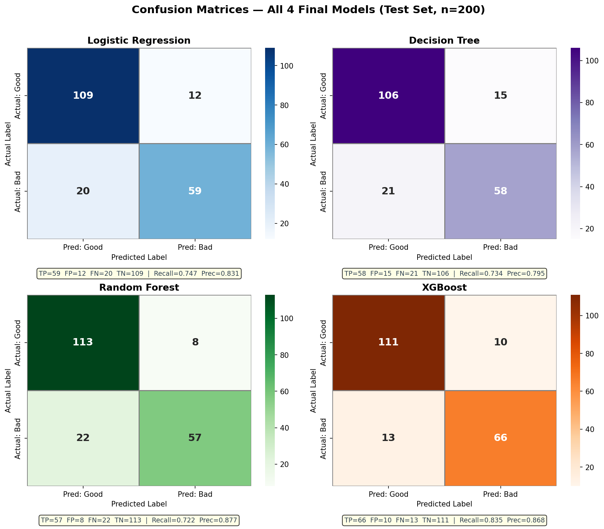

# Credit Risk Classification System

An end-to-end machine learning pipeline for predicting loan default risk using the German Credit dataset.

## Project Overview

This project builds and evaluates multiple machine learning models for credit risk classification, with a focus on minimizing false negatives (missed defaults).

The pipeline includes:
- Exploratory Data Analysis (EDA)
- Feature Engineering
- Model Training
- Hyperparameter Tuning
- Threshold Optimization
- Business Cost Analysis
- Deployment Planning

## Best Model

XGBoost (Tuned)

| Metric | Score |
|---|---|
| Accuracy | 0.885 |
| Precision | 0.868 |
| Recall | 0.835 |
| F1 Score | 0.852 |
| AUC-ROC | 0.954 |

## Technologies Used

- Python
- Scikit-learn
- XGBoost
- MLflow
- Pandas
- NumPy
- Matplotlib
- Google Colab

## Repository Structure

```text
credit-risk-classification/
│
├── notebooks/
├── reports/
├── images/
├── models/
├── src/
├── data/
```

## Key Insights

- XGBoost outperformed all other models
- Feature engineering significantly improved performance
- Threshold optimization reduced business risk
- Recall-focused optimization minimized missed defaults

## Visualizations

### ROC Curve



### Confusion Matrix



## Run Streamlit App

```bash
streamlit run app/streamlit_app.py
```

## Run FastAPI Server

```bash
uvicorn app.api:app --reload
```


## Features

- Modular ML pipeline
- XGBoost classifier
- Streamlit deployment
- FastAPI inference API
- Automated evaluation pipeline
- Feature engineering
- Threshold optimization
- Docker support

## Author

Mohammed Rashiku B C
